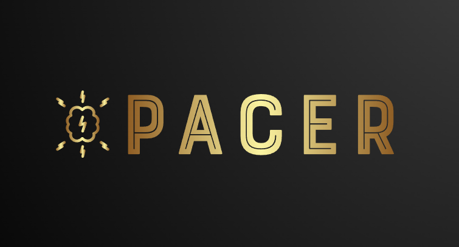

<!-- PROJECT LOGO -->
 

  

<h3 align="center">Pacer</h3>

  

    A solution for primary school CS education needs
     
     
    <a href="https://github.com/UTSCC09/project-pacer/issues">Ongoing Work</a>
    ·
    <a href="https://github.com/UTSCC09/project-pacer/pulls">Features in Review</a>
  

<!-- TABLE OF CONTENTS -->

  
Table of Contents

  <ol>
    <li>
      <a href="#about-the-project">About The Project</a>
    </li>
    <li><a href="#team-members">Team Members</a></li>
    <li><a href="#challenge-factors">Challenge Factors</a></li>
    <li>
      <a href="#roadmap">Roadmap</a>
      <ul>
        <li><a href="#beta-version">Beta Version</a></li>
        <li><a href="#final-version">Final Version</a></li>
      </ul>
    </li>
    <li><a href="#tech-stack">Tech Stack</a></li>
    <li><a href="#deployment-method">Deployment Method</a></li>
  </ol>

<!-- ABOUT THE PROJECT -->
## About The Project
Pacer is a synchronous live code editor for primary school CS instructors and children aged 8 - 10. The project arises out of a studnet need for an effective means of imitating their instructors' code and sharing their code for debugging. Pacer provides a platform where the instructors can share their code live to students whereupon the students can notify the instructor if they have questions and share their code live with the rest of class for debugging. Additionally, the teacher can save code files into the backend database and the class can access them at any point with the right credentials. Last but not least, the teachers will gain live notifications of the students' code execution results. Here is a detailed breakdown of project components:

* Base Component: \
Each session (a code editor window) looks like [trinket.io](https://trinket.io/python/699b7d37d2) (with only save, load, and run functionaties planned, addtional features as bonus)

* Editor Layout: \
The teacher (as the admin) has multiple buttons in the side bar that link to each student session. Clicking on it brings up the student code editor and the teacher has the option to share it with the class and edit it as well. [kw: A chat box where all students and the teacher can ask/answer questions on, public/private message available.]The students each has two windows, one is their teacher’s session another one is their own session. The teacher's session will be replaced by another student's if the teacher decides to share their screen. No concurrent code editing is necessary as only the teacher or the student can edit the file at one time.

* File Access: \
Both the students and the teacher have the option to save/load files. Automatic saving will be performed after certain time interval in case of server failure. Teachers have the option to create a new file which will replace the existing teacher session on student window with a new session. [kw: Students are able to access the files save by the teacher at any time during class for references.]

* Additional Features: \
Students can request help from the teacher by clicking on a help button and inputting a message whereupon the teacher will receive a notification from the students with the message. \
Students can execute their code independently and the teacher can see the output of the execution. 

* Extended goal: \
student code will be highlighted in red if they don’t match the teacher’s. \
[kw: video call].

(<a href="#top">back to top</a>)

## Team Members

* Mengde Wang
* Maxim Khaissarov
* Sijia Wei

(<a href="#top">back to top</a>)

## Challenge Factors

* Real-time Interactions: \
The web app allows the students to sync up with the teacher's code in real time. Conversely, the teacher can view will student code session as well as sharing and editing them live.

* Webhooks: \
Listens to student request for help and student execution results (in conjunction with WebRTC) to report to the teacher.

* In depth web technology usage: \
In-depth exploration of codemirror features to provide autocompletion, syntax highlight, linting, multi-language support and so on to all sessions. In-depth research on socket-io and WebRTC to provide seamless sharing experience.

* Non-trivial frontend: \
Have the code windows movable/draggable, or have a color 3d frontend interface implemented with 3.js to intrigue children

(<a href="#top">back to top</a>)

## Roadmap

### Beta Version

1. Project deployed on VM with all necessary docker images
2. Code editor session complete with all editor featurs in place (e.g. linting)
3. A classroom where teachers have access to all student sessions and be able to modify student codes. Student has access to their sessions and the teacher's.
4. Teacher can receive student's code execution results.
5. Hook up with the backend database with functional save and load abilities.

(<a href="#top">back to top</a>)

### Final Version

1. Students can request for help from the teacher
2. The teacher can project a student's session to other students
3. Implement classroom authorization and improve network security measures
4. Complete front end interface (3d interface or drag and drop ability)
5. Implement extented goal of text highlight if time permits
6. testing

(<a href="#top">back to top</a>)

## Tech Stack

* Frontend: 
[React.js](https://reactjs.org/), [React-three-fiber](https://github.com/pmndrs/react-three-fiber) (Optional) \
One of the most popular front-end framework that is based on JS with not-too steep learning curve which is ideal for our use case which does not rely heavily on front end. The react-three-fiber is a version of React that supports three.js. We will use this to implement 3D frontend if needed.

* Reverse Proxy:
[Nginx](https://www.nginx.com/) \
One of the most commonly used, high-performance and supports scaling if we take it into account in the future.

* Real-time + Persistent Storage: [Firestore](https://cloud.google.com/firestore) \
Firestore provides both fast real-time storage to cater synchronous editing and persistent storage to handle code files. Comparing to Redis, the persistent aspect is easier to control and easier to query. 

* Code Formatting: [Codemirror](https://codemirror.net/) \
A necessary public library for the text editor to recognize codes, style codes and implement editor features like linting, autocomplete and much more.

* Communication: [Socket.io](https://socket.io/) and [WebRTC](https://webrtc.org/) \
The plan is to use socket.io as client-server connection between students and teachers where students are clients that are served the teacher's code. When a student requests screensharing, it will use WebRTC connection to broadcast user screen across all members in the class room as a peer to peer service. This is subject to change as the project evolves. 

* VM: [Digital Ocean](https://www.digitalocean.com/products) \
Chosen for the ease of setup and the Github student bundle also provides free credits for project use.

(<a href="#top">back to top</a>)

## Deployment Method

At first, we will register free a domain name. Then create a VM on Digital Ocean using the static IP as the domain. Setup node related resources in VM as well. Deployment will be performed via docker images uploaded to the hosting VM. At setup, a dockerfile will be created for each dependency that requires one, after docker images are generated, they are uploaded to VM in production. Each new iteration of the app will be packaged as a docker image after git hub reviews are complete, and then it will be deployed to VM as a production build and tested.

(<a href="#top">back to top</a>)

